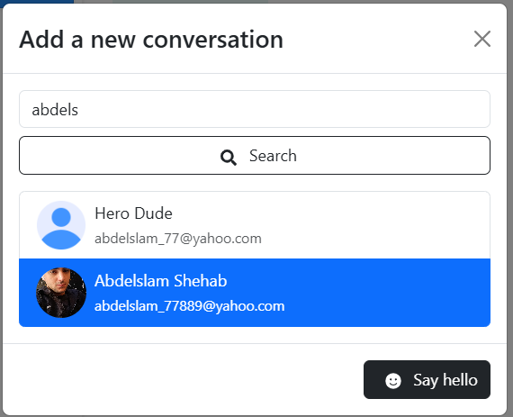
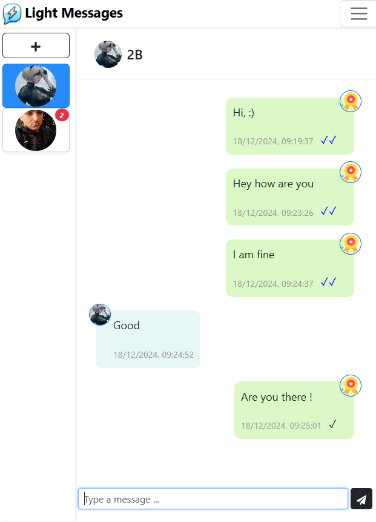
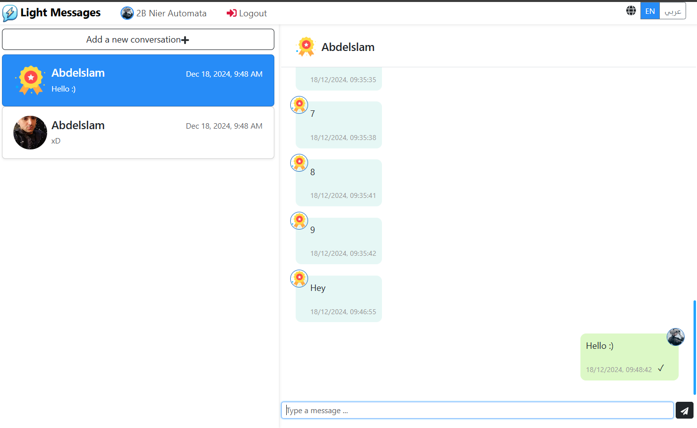

# Light Messages Frontend

A web application frontend designed to serve [Light Messages Backend](https://github.com/abdelslam1997/light_messages_backend).

## Table of Contents
- [Preview Images](#preview-images)
- [Prerequisites](#prerequisites)
- [Installation](#installation)
- [Environment Configuration](#environment-configuration)
- [Development](#development)
- [Production Build](#production-build)
- [License](#license)

## Preview Images





## Prerequisites

Before you begin, ensure you have installed:
- [Node.js](https://nodejs.org/)
- [npm](https://www.npmjs.com/)

## Installation

1. Clone the repository:
    ```bash
    git clone https://github.com/abdelslam1997/light_messages_frontend.git
    cd light_messages_frontend
    npm install
    ```

## Environment Configuration

Create a `.env` file in the project root and configure:
```bash
REACT_APP_API_BASE_URL=http://light-messages.local/api/v1
REACT_APP_WEBSOCKET_URL=ws://light-messages.local/ws
```
> Note: Replace `light-messages.local` with your backend URL

## Development

Start the development server:
```bash
npm run dev
```
Access the application at `http://localhost:5173`

## Production Build

### Docker Build
Build and run using Docker:
```bash
# Build the image
docker build -f docker/production/Dockerfile -t light_messages_frontend:latest .

# Run the container
docker run -p 80:80 light_messages_frontend:latest
```

### Environment Variables
The production build uses these environment variables:
```bash
REACT_APP_API_BASE_URL=http://your-api-domain/api/v1
REACT_APP_WEBSOCKET_URL=ws://your-api-domain/ws
```

### Continuous Integration
The project uses GitHub Actions for automated builds:
- Triggers on pushes to main branch with commit message containing 'build-docker-image'
- Builds and pushes to Docker Hub as `abdelslam1997/light_messages_frontend`
- Tags: `latest` and `v1.0.x`

To trigger a build:
```bash
git commit -m "your changes [build-docker-image]"
git push origin main
```

## License

This project is licensed under the [MIT License](LICENSE).
